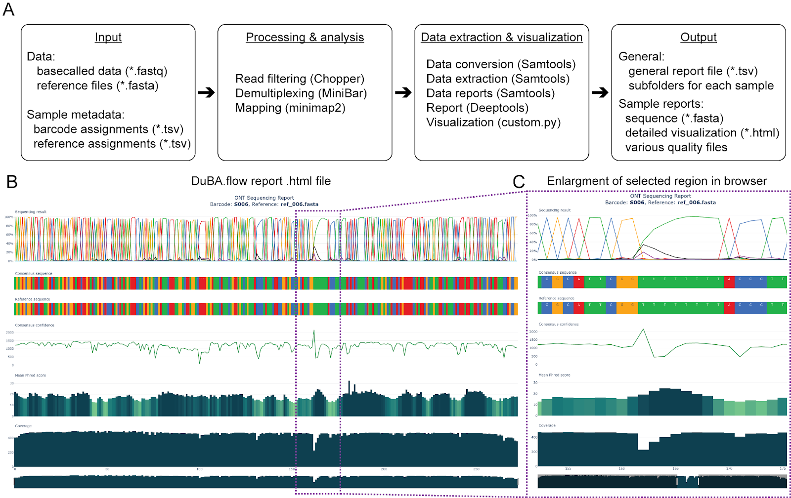

# DuBA.flow Pipeline
A dual barcode amplicon sequencing workflow for efficient and highly parallelized long-read sequencing-based DNA validation 


## Description


DuBA.flow is an integrated analysis pipeline designed to process and analyze basecalled genomic data. The pipeline streamlines multiple bioinformatics tasks including demultiplexing, reference mapping, quality control, and data visualization. It is made conveniently available as a Docker image, eliminating version incompatibilities and simplifying deployment. 

### Tested
Duba.flow was tested using Python version 3.11.2 and Micromamba version 1.4.6.  It employs the subsequent software packages:
| Software | Version |
|----------|---------|
| [minibar](https://github.com/calacademy-research/minibar) | 0.25 |
| [chopper](https://github.com/wdecoster/chopper)  | 0.5.0 | 
| [minimap2](https://github.com/lh3/minimap2) | 2.26-r1175 |
| [samtools](https://github.com/samtools/samtools) | 1.17 |
| [deeptools](https://github.com/deeptools/deepTools) | 3.5.2 |

## Getting Started
### Input
**Directory Structure**    
The input directory for DuBA.flow should be organized as follows:
``` bash
.
├── references
│   ├── reference1.fasta
│   └── reference2.fasta
│   └── ...
├── IndexCombination.tsv
├── input.fastq.gz
└── references.tsv
```

Where
- `input.fastq.gz` is the compressed file containing your basecalled data.
- `references` Folder: is a folder which should contain all relevant reference sequences in FASTA format.
- `IndexCombination.tsv` and `references.tsv` are metadata files in Tab-Separated Value (TSV) format.
  

Here, the `IndexCombination.tsv` file should be structured as depicted below
|SampleID |	FwIndex | FwPrimer | RvIndex | RvPrimer |
|---------|---------|----------|---------|----------|
|S001	|AAGAAAGTTGTCGGTGTCTTTGTG	|CCCAGTCACGACGTTGTAAAACG	|AAGAAAGTTGTCGGTGTCTTTGTG	|AGCGGATAACAATTTCACACAGG
|S002|	AAGAAAGTTGTCGGTGTCTTTGTG	|CCCAGTCACGACGTTGTAAAACG	|TCGATTCCGTTTGTAGTCGTCTGT	|AGCGGATAACAATTTCACACAGG|
| ... | ... | ... | ... | ... | ...|  

(*Note*: For more details on this format, see the [MiniBar documentation](https://github.com/calacademy-research/minibar). )

and the `references.tsv`  

|SampleID | ReferenceFile|
|----------|-------------|
|S001	|J23100_AB.fasta|
|S002	|J23100_EB.fasta|
| ...   |       ...     |

*Note*: The reference files listed in `references.tsv` should be present and match the files in the `references` folder.

### Execution
To eliminate version incompatibilities and simplify setup, DuBA.flow is available as a Docker image. If you're new to Docker follow the quick start guide that can be found [here](https://docs.docker.com/desktop/get-started/).

<ins>**Step 1: Pull the Docker Image**</ins>   
To download the [Docker image](https://hub.docker.com/r/cedkb/dubaflow), open your terminal and run the following command:
```
docker pull cedkb/dubaflow:latest
```

<ins>**Step 2: Run Docker Container**</ins>    
To start the Docker container, use the following command:
```
docker run --name {container_name} --workdir /home/dubaflow -it --mount type=bind,src={home_path},dst=/home/dubaflow/input cedkb/dubaflow:0.2
```
where
- `{container_name}` is any name you choose for the Docker container.
- `{home_path}` is the path to an empty folder on your host machine.
For example:
``` 
docker run --name dubaflow_test --workdir /home/dubaflow -it --mount type=bind,src=C:\Users\Cedric\Documents\DockerVolumes\dubaflow,dst=/home/dubaflow/input cedkb/dubaflow:latest
```
*Note: Run the command as a single line.*

<ins>**Step 3: Parse the Input Data**</ins>    
Once the container is up, navigate to the folder specified by `{home_path}` and copy all of the neccessary input files described above

<ins>**Step 4: Run the Pipeline**</ins>    
After successfully copying and setting the input data, execute the following command inside the Docker container
```
python3 DuBaFlow.py
```

### Output
Upon successful completion of the DuBA.flow program, an `output` folder will be generated at the predefined `{home_path}`. This folder contains a structured output, including:
- A subfolder for each sample containing individual reports.
- A general report file that serves as an overview.


<ins>**General Report**</ins>   
Example
The general report file will display statistics similar to the following table:
|SampleID	|Success	|Total Sequences	|Reads Mapped	|Error Rate	|Average Length	|Average Quality |
|---|---|---|---|---|---|---|
|S001	|True	|1708.0	|1606.0	|0.06253874	|581.0	|19.5|
|S002	|True	|295.0	|292.0	|0.06077209	|688.0	|19.6|
|...|...|...|...|...|...|...|

**Description**    
The columns in the general report file are explained as follows:
| Index | Type | Description |
|-------|------|-------------|
| SampleID | string | The SampleID as defined in `reference.tsv` |
| Success | bool | 	Indicates if the analysis was successful for the sample |
| Total Sequence | int | Number of sequences for the sample |
| Reads Mapped | int | Number of mapped sequences (using minimap2) |
| Error Rate | float | Error rate as calculated by samtools stats |
| Average Length | float | Average length as calculated by samtools stats |
| Average Quality | float | Average quality as calculated by samtools stats |


<ins>**Individual Sample Reports**</ins>   
Each sample-specific subfolder will contain:
- `consensus_sequence.fasta`: This file contains the consensus sequencing result.
- `report.html`: An easy-to-read and interactive HTML report file that provides all essential information.  
**Additional Files**  
Besides the primary output files, several secondary files like *.bam*, *.pileup*, *.coverage*, and stats will also be generated in the individual sample report folders.


## Publication
Rojas, A. A. R., Brinkmann, C. K., Köbel, T. S., & Schindler, D. (2023). DuBA.flow – A dual barcode amplicon sequencing workflow for efficient and highly parallelized long-read sequencing-based DNA validation.

## License
This is a repository written under the [CC BY-NC-SA 4.0 license](https://creativecommons.org/licenses/by-nc-sa/4.0/)

## References
Krehenwinkel, H., Pomerantz, A., Henderson, J. B., Kennedy, S. R., Lim, J. Y., Swamy, V., Shoobridge, J. D., Graham, N., Patel, N. H., Gillespie, R. G., & Prost, S. (2019). Nanopore sequencing of long ribosomal DNA amplicons enables portable and simple biodiversity assessments with high phylogenetic resolution across broad taxonomic scale. In GigaScience (Vol. 8, Issue 5). Oxford University Press (OUP). https://doi.org/10.1093/gigascience/giz006

Li, H. (2018). Minimap2: pairwise alignment for nucleotide sequences. In I. Birol (Ed.), Bioinformatics (Vol. 34, Issue 18, pp. 3094–3100). Oxford University Press (OUP). https://doi.org/10.1093/bioinformatics/bty191

Danecek, P., Bonfield, J. K., Liddle, J., Marshall, J., Ohan, V., Pollard, M. O., Whitwham, A., Keane, T., McCarthy, S. A., Davies, R. M., & Li, H. (2021). Twelve years of SAMtools and BCFtools. In GigaScience (Vol. 10, Issue 2). Oxford University Press (OUP). https://doi.org/10.1093/gigascience/giab008

De Coster, W., & Rademakers, R. (2023). NanoPack2: population-scale evaluation of long-read sequencing data. In C. Alkan (Ed.), Bioinformatics (Vol. 39, Issue 5). Oxford University Press (OUP). https://doi.org/10.1093/bioinformatics/btad311

Ramírez, F., Ryan, D. P., Grüning, B., Bhardwaj, V., Kilpert, F., Richter, A. S., Heyne, S., Dündar, F., & Manke, T. (2016). deepTools2: a next generation web server for deep-sequencing data analysis. In Nucleic Acids Research (Vol. 44, Issue W1, pp. W160–W165). Oxford University Press (OUP). https://doi.org/10.1093/nar/gkw257

